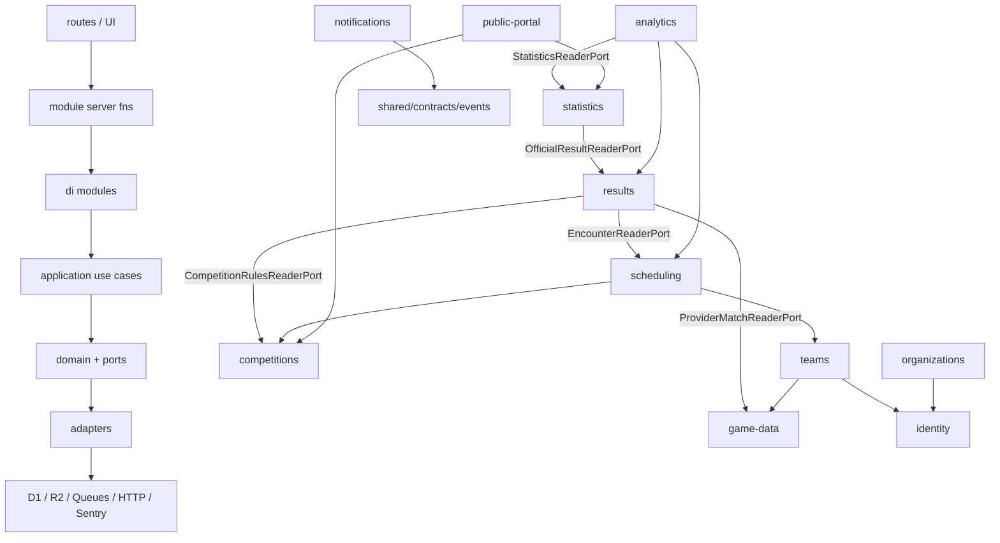
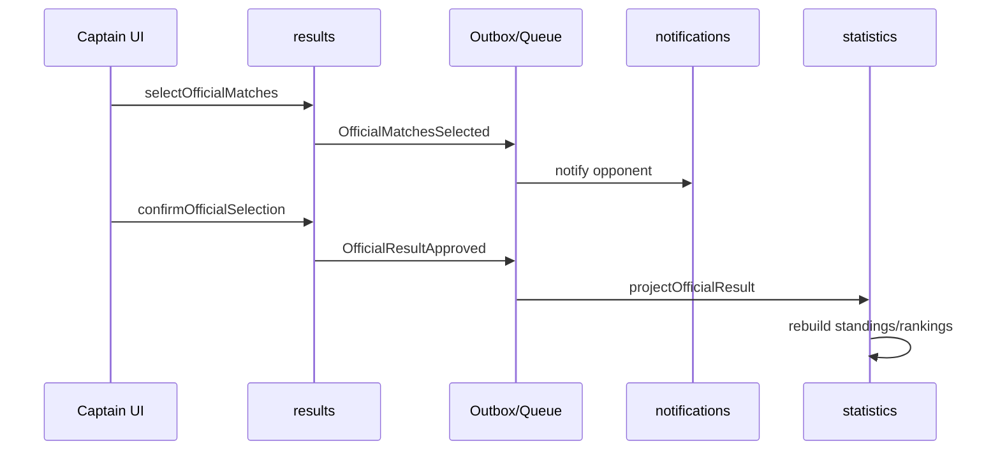
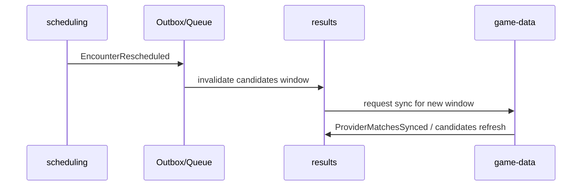

# Grafo de dependencias

Estado: canónico  
Relacionado: [overview](/docs/architecture/overview.md) · [module-boundaries](/docs/architecture/module-boundaries.md)

## Módulos (DAG lógico)

Los edges entre módulos son **APIs públicas / ports / eventos**, nunca imports de adapters.

## Flujo selection → stats

## Flujo reschedule → candidatos

## Verificación

- Import lint: `domain` sin adapters; `src/di` único lugar de concreciones.
- Tests de dominio sin I/O.
- Application tests con ports fake.
- Adapter tests D1 + fixtures EA sanitizadas.
- Aislamiento two-org.
- Replay de queue/outbox/confirmación.
