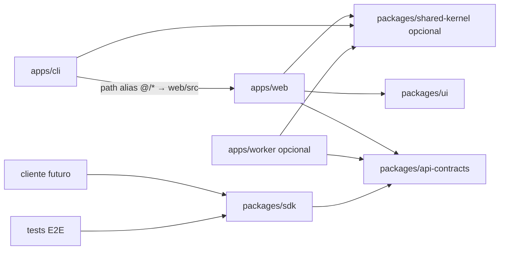

# Packages y SDK

Estado: scaffolded (stubs)  
Fecha: 2026-07-17  
Relacionado: [overview](/docs/architecture/overview.md) · [ADR-0001](/docs/adr/0001-monorepo-and-tanstack-start-deployable.md) · [ADR-0005](/docs/adr/0005-typed-private-api.md) · Guía práctica: [`/packages/README.md`](/packages/README.md)

## Objetivo

Reservar `packages/` para código **compartido entre deployables o clientes**, no para mover los bounded contexts hexagonales demasiado pronto.

En el MVP:

- El dominio de negocio vive en `apps/web/src/modules/*`.
- `packages/` empieza pequeño (contratos + UI + SDK + kernel + test-support).
- Un `apps/worker` separado solo aparece si el mismo Worker no basta.

## Forma del monorepo

```text
futrob/
├── apps/
│   ├── web/                    # TanStack Start + Workers (UI, BFF, API, queue handlers iniciales)
│   ├── cli/                    # playground dominio (tsx; fmt/lint vía Vite+ root, sin vite-plus app)
│   └── worker/                 # opcional: sync / projections / analytics a escala
│
├── packages/
│   ├── api-contracts/          # Zod + OpenAPI de /api/v1 y errores
│   ├── sdk/                    # cliente tipado sobre api-contracts
│   ├── ui/                     # tokens + primitivas shadcn/Base UI
│   ├── shared-kernel/          # Result, DomainEvent (migración desde web al crear worker)
│   └── test-support/           # fakes/builders solo para tests
│
├── product/
└── docs/
```

No crear de entrada un package por cada módulo (`packages/results`, `packages/game-data`, …). Eso se evalúa cuando `apps/worker` o el SDK necesiten **use cases in-process**, no solo HTTP.

## Qué va en cada package

### `packages/api-contracts`

Fuente de verdad del **transporte HTTP privado** (`/api/v1`).

```text
packages/api-contracts/src/
├── v1/
│   ├── competitions/           # a medida que existan endpoints
│   ├── encounters/
│   ├── results/
│   ├── teams/
│   ├── meta/
│   ├── errors.ts
│   └── index.ts
├── openapi/                    # generación CI (futuro)
└── index.ts
```

Contiene schemas Zod, discriminadores `v1` y tipos inferidos. No contiene entidades de dominio, reglas de selección, clientes HTTP ni D1.

`apps/web` valida inbound con estos schemas y mapea a commands de application. El dominio **no** importa Zod.

### `packages/sdk`

Cliente tipado para consumidores de la API privada (futuro Flutter, scripts, integraciones internas, tests E2E).

```text
packages/sdk/src/
├── client.ts                   # createFutrobClient({ baseUrl, getAccessToken })
├── http.ts
├── resources/
│   ├── meta.ts                 # ping scaffold
│   ├── competitions.ts         # stubs
│   ├── encounters.ts
│   ├── results.ts
│   ├── teams.ts
│   └── organizations.ts
├── errors.ts
└── index.ts
```

Reglas:

- Depende solo de `api-contracts` (+ fetch/HTTP).
- **No** importa `apps/web/src/modules/*` ni adapters.
- No es API pública de terceros en el MVP (ADR-0005); package privado del monorepo.
- Versionado alineado con `api-contracts` (`@futrob/sdk@0.x` ↔ `/api/v1`).

### `packages/ui`

Primitivas y tokens reutilizables (shadcn/Base UI). No conoce competiciones, EA ni permisos. Las pantallas de negocio siguen en `apps/web`.

### `packages/shared-kernel`

Tipos técnicos compartibles: `Result`, `DomainEvent`. Hoy duplica el scaffold de `apps/web/src/shared`; migrar imports cuando exista `apps/worker`.

### `packages/test-support`

Builders y fakes compartidos usados por más de un workspace. Solo tests.

## Qué **no** va en `packages/` al inicio

| Tentación                                     | Por qué no (aún)                                          |
| --------------------------------------------- | --------------------------------------------------------- |
| `packages/game-data`                          | Solo lo usa web; vive en `apps/web/src/modules/game-data` |
| `packages/results`                            | Idem; extraer si worker ejecuta use cases in-process      |
| SDK que envuelva server functions de TanStack | El SDK habla HTTP `/api/v1`, no internals de Start        |
| Cliente EA en un package público              | El adapter EA es privado de `game-data`                   |

## Relación con apps



## Criterios para extraer un módulo a package

Extraer `apps/web/src/modules/<x>` → `packages/<x>` solo si:

1. `apps/worker` necesita el mismo use case sin HTTP, o
2. Dos apps importan el mismo dominio sin pasar por API, o
3. El package tiene API pública estable y tests propios que justifican el costo.

Hasta entonces, **feature modules dentro de web** son la opción por defecto.

## Naming npm

```text
@futrob/api-contracts
@futrob/sdk
@futrob/ui
@futrob/shared-kernel
@futrob/test-support
@futrob/web
@futrob/worker          # cuando exista
```

## Resumen

- **`packages/`** = contratos, UI, kernel técnico, SDK, test-support — no el dumping de todos los bounded contexts.
- **`packages/sdk`** = cliente HTTP tipado sobre `api-contracts`, sin dominio hexagonal dentro.
- **Dominio Clubs/EA** permanece en `apps/web/src/modules` hasta que un segundo deployable lo exija in-process.
- Guía operativa: [`/packages/README.md`](/packages/README.md).
