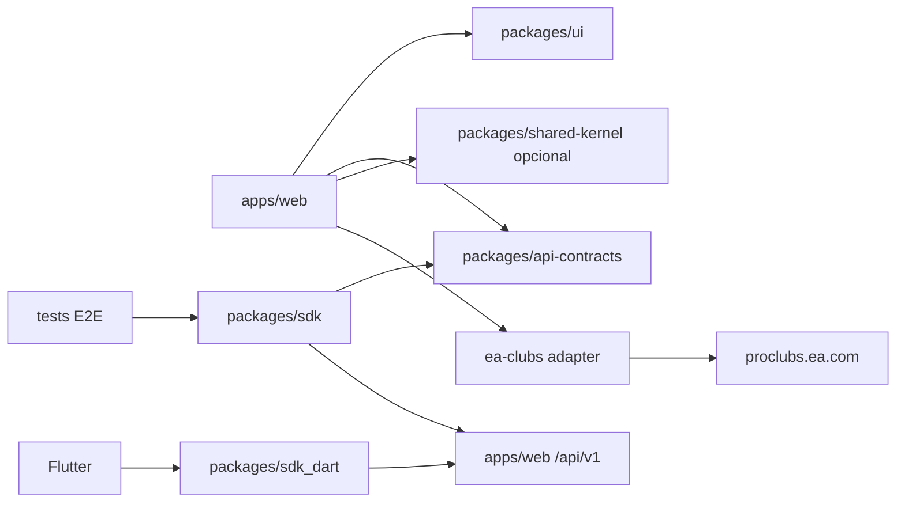

# Packages y SDK

Estado: activo (game-data v1 + dual SDK)  
Fecha: 2026-07-18  
Relacionado: [overview](/docs/architecture/overview.md) · [ADR-0001](/docs/adr/0001-monorepo-and-tanstack-start-deployable.md) · [ADR-0005](/docs/adr/0005-typed-private-api.md) · [ADR-0006](/docs/adr/0006-game-data-provider-port.md) · Guía práctica: [`/packages/README.md`](/packages/README.md)

## Objetivo

Reservar `packages/` para código **compartido entre deployables o clientes**, no para mover los bounded contexts hexagonales demasiado pronto.

En el MVP:

- El dominio de negocio vive en `apps/web/src/modules/*`.
- `packages/` contiene contratos, UI, SDKs (TS + Dart), kernel y test-support.
- `/api/v1` se sirve desde `apps/web` (mismo Worker). **No** existe `apps/api` (ADR-0001).
- Un `apps/worker` separado solo aparece si el mismo Worker no basta.

## Forma del monorepo

```text
futrob/
├── apps/
│   ├── web/                    # TanStack Start + Workers (UI, BFF, /api/v1, queues)
│   ├── cli/                    # playground dominio
│   └── worker/                 # opcional
│
├── packages/
│   ├── api-contracts/          # Zod + OpenAPI de /api/v1
│   ├── sdk/                    # cliente TypeScript (estilo Stainless)
│   ├── sdk_dart/               # cliente Dart (mismo contrato)
│   ├── ui/
│   ├── shared-kernel/
│   └── test-support/
│
├── product/
└── docs/
```

## Qué va en cada package

### `packages/api-contracts`

Fuente de verdad del **transporte HTTP privado** (`/api/v1`).

Incluye schemas Zod de `game-data` (clubs search/retrieve/matches), meta, errores, y documento OpenAPI en `src/v1/openapi/document.ts`. Regenerar con `npm run generate:openapi -w @futrob/api-contracts`.

`apps/web` sirve:

- `GET /api/v1/openapi.json`
- `GET /api/v1/openapi.yaml`

El dominio **no** importa Zod. El OpenAPI no oficial de EA vive solo bajo `game-data/adapters/providers/ea-clubs/openapi/` y **no** se sirve como contrato Futrob.

### `packages/sdk` / `packages/sdk_dart`

Clientes tipados estilo Stainless (`client.gameData.clubs.search|retrieve|matches`) para consumidores de la API privada (Flutter, scripts, E2E).

Reglas:

- Dependen solo de contratos + HTTP (TS: `@futrob/api-contracts`).
- **No** importan `apps/web/src/modules/*` ni adapters.
- **No** llaman a proclubs.ea.com.
- No son API pública de terceros en el MVP (ADR-0005).

### `packages/ui` / `shared-kernel` / `test-support`

Sin cambios de rol (ver guía práctica).

## Relación con apps



## Naming

```text
@futrob/api-contracts
@futrob/sdk
futrob_sdk          # pub (packages/sdk_dart)
@futrob/ui
@futrob/shared-kernel
@futrob/test-support
@futrob/web
```

## Resumen

- **`packages/sdk` + `sdk_dart`** = clientes HTTP tipados sobre el contrato Futrob.
- **EA** permanece en el adapter de `game-data`.
- **No `apps/api`**: handlers en `apps/web` llaman use cases vía DI.
